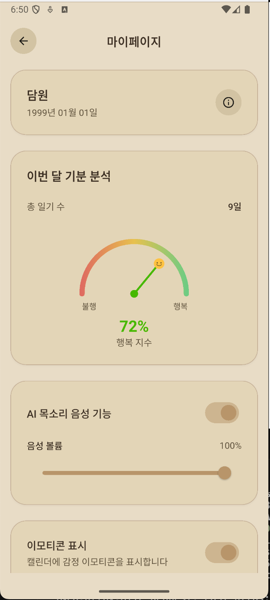

# AI Mini Implementation Project

AI 기반 일기장: Flutter 프론트엔드, FastAPI 백엔드, 통합 AI 서비스(STT, TTS, 감정분석, 운세)로 구성된 프로젝트입니다.

## 주요 기능
- 일기 작성, 수정, 삭제, 조회 (이미지 첨부 가능)
- AI 감정 분석 및 이모지 자동 매핑
- 음성(STT) 인식, TTS 음성 합성 (사용자 설정 반영)
- 캘린더 기반 일기 관리
- 사용자별 TTS/이모지/프로필 설정
- JWT 인증

## 프로젝트 구조
```
mini/
├── lib/           # Flutter 앱 소스
├── backend/       # FastAPI 백엔드
├── ai/            # 통합 AI 서비스 (ai_service.py)
├── assets/        # 정적 파일
├── start_project.py      # 전체 실행 스크립트
├── start_backend.py      # 백엔드만 실행
├── start_flutter.py      # Flutter만 실행
└── README.md
```

## 설치 및 실행
1. Python 3.8+, Flutter SDK, MongoDB 설치
2. 저장소 클론 및 의존성 설치
   ```bash
   git clone https://github.com/your-username/mini.git
   cd mini
   pip install -r backend/requirements.txt
   flutter pub get
   ```
3. 전체 실행 (권장)
   ```bash
   python3 start_project.py
   ```
   또는 개별 실행:
   ```bash
   python3 start_backend.py
   python3 start_flutter.py
   cd ai && uvicorn ai_service:app --reload --port 8002
   ```

## 주요 화면 예시

<div align="center">

<table>
  <tr>
    <td></td>
    <td></td>
    <td></td>
  </tr>
  <tr>
    <td></td>
    <td></td>
    <td></td>
  </tr>
  <tr>
    <td></td>
    <td></td>
    <td></td>
  </tr>
</table>

</div>

## API 문서
- 백엔드: http://localhost:8000/docs
- AI 서비스: http://localhost:8002/docs

## 문제 해결
- Flutter 오류: `flutter clean && flutter pub get`
- Python 오류: `pip install -r backend/requirements.txt`
- MongoDB/AI 서비스: 실행 상태 및 환경변수 확인

## 라이선스
본 프로젝트는 교육 및 연구 목적으로 제작되었습니다.
